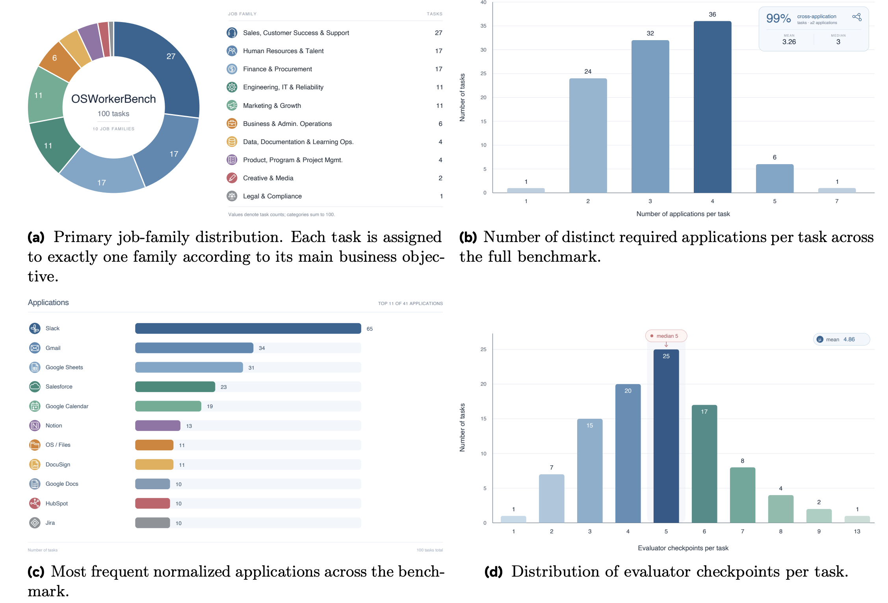

# OSWorker Benchmark Task Suite

The canonical OSWorker release contains **100 realistic desktop tasks** spanning
**10 high-level job families** and **17 operational tracks**. The suite is
deliberately cross-application: 99% of tasks require more than one application,
with a mean of 3.26 and a median of 3 applications per task. Evaluators check a
mean of 4.86 task milestones, providing substantially richer verification than
a single final-state assertion.

## 📊 Benchmark Tasks Overview

<p align="center">
  
</p>

<p align="center">
  <sub><strong>Figure 1.</strong> Coverage across job families, application breadth, frequently used applications, and evaluator depth.</sub>
</p>

The figure groups the benchmark into 10 reader-facing job families; the
directory and task-id organization below uses the finer-grained 17-track
vocabulary. Slack, Gmail, Google Sheets, Salesforce, and Google Calendar are the
most frequent applications, while the long tail covers productivity,
engineering, finance, design, and compliance workflows.

The rest of this document is the normative specification for **task ids**,
**task-config fields**, and the external **cache layout**. Task configurations
are distributed with the repository. `osworker_cache/`, which contains runtime
assets and evaluator scripts, is supplied separately and is not tracked in Git.
Before running the benchmark, ensure that the cache contains a same-named
subdirectory for every task id in `osworker_benchmark_full.json`.

## Non-negotiable naming rules: exact agreement in four locations and a derivable domain

For a given task, the names in the following **four locations must match exactly**, including case:

```
id in meta  ==  examples filename (without .json)  ==  "id" inside config  ==  cache subdirectory name
```

- Meta: `osworker_benchmark_full.json`, with the structure `{track: [task_id, ...]}`
- Task: `examples/{track}/{task_id}.json`
- Cache: `{cache_dir}/{task_id}/` (defaults to `osworker_cache/` and contains `initial_setup.py` / `reward.py` / `_cua_gym_vm_bridge.sh`)

**Fifth rule: `domain` == the first segment of the id (the track).** Therefore, `ar_aging_001` must be under `examples/ar/`,
its cache must be at `osworker_cache/ar_aging_001/`, and it must be listed under the `"ar"` key in meta.
Every location can therefore be derived from the id without consulting a lookup table.

Each id must be globally unique; domain-based disambiguation is not allowed. The runner's retry logic locates results at
`**/{domain}/{task_id}/result.txt`, so same-named tasks would overwrite each other.

## Directory structure

```
evaluation_examples/OSWorker/
├── README.md
├── osworker_benchmark_full.json     # meta, {track: [id...]}, 17 tracks / 100 tasks
└── examples/{track}/{id}.json       # active tasks, in one-to-one correspondence with meta
```

The corresponding external cache is located at `osworker_cache/{id}/`. When retiring a task, remove it from `examples/`, meta,
and the external cache at the same time. If it is re-enabled, restore it with its original id.

## id grammar

```
task_id  := <track> "_" <capability> "_" <seq> <modifier>*

track    := controlled vocabulary (see below), [a-z][a-z0-9]{1,7}
capability := 1-4 snake_case words, [a-z][a-z0-9]*(_[a-z0-9]+){0,3}
seq      := exactly 3 digits, increasing within <track> (not within track_capability)
modifier := "__v" <N>  |  "__long"  |  "__cond"
```

The character set is restricted to `[a-z0-9_]`. **Uppercase letters, Chinese characters, spaces, `-`, `.`, and `,` are prohibited.**

| Component | Rule | Examples |
|---|---|---|
| `track` | Business-role or capability track, selected from the controlled vocabulary | `ae` `csm` `ar` |
| `capability` | What the task tests, expressed as a verb-object or noun phrase | `forecast` `email_to_crm_case` |
| `seq` | Three-digit serial number within the track; increases monotonically and is never reused | `001` `042` |
| `__vN` | Variant N, a rewrite of the same underlying task | `__v1` `__v2` |
| `__long` | Long-horizon task; see the criteria below | |
| `__cond` | Conditional task whose prompt contains branches that require different paths depending on the condition | |

### Criteria for `__long`

A task is long-horizon if it meets **any** of the following criteria:

1. **Coordination across three or more applications** — data must be read and written while moving between multiple applications or tabs
2. **Repetition of the same operation across multiple objects** — for example, "apply the same edit to five files in sequence" or "create one ticket for every record"
3. **A single operation chain exceeding approximately 20 steps**

Do not classify a task from the length of its instruction. A long instruction may simply provide detailed background and need not imply many actual operation steps.

Modifiers begin with a **double underscore** `__`, distinguishing them from the single underscores in the main id. As a result, `ar_payment_002` and
`ar_payment_002__v1` can be split unambiguously with a regular expression. Append multiple modifiers in this order: `__vN` → `__long` → `__cond`.

Complete examples:

```
ae_pipeline_review_004               # Task 4 in the AE track, a pipeline review
csops_incident_command_004           # Task 4 in the CS Ops track, incident command
calc_income_statement_001__long      # Task 1 in the Calc track, batch editing five files
ops_pdf_mail_012__long__cond         # Task 12 in the Ops track, long-horizon + conditional branch
```

## Controlled vocabulary for tracks

Register a new track in this table before using it to prevent synonymous abbreviations such as `recruit` and `recruiting` from coexisting.
The numbers in parentheses are the current task counts.

| track | Meaning | track | Meaning |
|---|---|---|---|
| `ae` | Account Executive, sales (4) | `pm` | Product / Project Manager (3) |
| `am` | Account Manager, customer renewals (4) | `qa` | Quality Assurance / code review (4) |
| `ar` | Accounts Receivable, receivables / reconciliation (12) | `recruit` | Recruiting (8) |
| `csm` | Customer Success Manager (5) | `sdr` | Sales Development Rep (6) |
| `csops` | Customer Support Ops (6) | `sre` | Site Reliability / on-call (3) |
| `hr` | Human Resources (9) | `ops` | General business operations (12) |
| `itops` | IT support / system administration / access control (4) | `calc` | LibreOffice Calc batch spreadsheet operations (5) |
| `mktg` | Marketing (11) | `img` | GIMP batch image processing (2) |
| `fin` | Expense reimbursement (2) | | |

The first 13 tracks are organized by **business role**. The remaining four (`ops` / `calc` / `img` / `fin`) cover scenarios without a clear role.
`ops` is the catch-all track: small categories containing a single task, such as the former one-task categories for document conversion, transcripts, and license auditing, must be merged into
`ops`. Do not create a new track for a single task.

**Do not introduce opaque numbers such as `profNN`.** Historical identifiers such as `prof13` and `prof26` were internal role numbers
that conveyed no information to readers. During the 2026-08 renaming, they were assigned to the tracks above according to the role stated in each task prompt.

## id freezing policy

**Once a task has been added to meta and run, its id is frozen.** To change the task prompt, publish a new `__vN` variant
instead of changing the id in place. Keep the id unchanged when retiring a task, and restore it unchanged if the task is re-enabled.

The reason is that **id is the primary key across runs.** Renaming prevents `get_unfinished_tasks()` from recognizing historical results,
forces the entire suite to rerun from scratch, and causes analysis scripts for historical runs to miss every path because they still use the old id.
The gamedev suite under `evaluation_examples/democua` has already encountered this problem; see the README in that directory.

### One-time renaming (2026-08)

When this specification was introduced, all 100 active tasks underwent a **one-time renaming** that normalized five historical forms to the grammar above:

| Previous form | Count | Current form |
|---|---|---|
| Bare uuid (`054e615f-1839-…`) | 46 | Assigned to tracks according to task semantics |
| uuid + `_5` (upstream long tasks, including one malformed uuid) | 9 | `calc_*__long` / `img_*__long` / `ops_*__long` |
| `c0nd…` (the first four uuid characters rewritten) | 3 | `fin_*__long__cond` / `ops_*__long__cond` |
| `profNN_*` (opaque role number) | 14 | Assigned to tracks according to the role stated in the task prompt |
| Semantic ids with disordered seq values | 28 | Resequenced contiguously from 001 within each track |

This was **an exception, not a precedent**. As a consequence, all earlier run result directories use the old ids and cannot be resumed directly.
The historical id mapping was a one-time migration artifact and is not distributed with the active task set.

**The renaming deliberately left two categories of external references untouched.** Their paths embed old ids but point to off-site resources:

- Hugging Face URLs in 12 task configs, such as
  `…/long_repetitive_bench/resolve/main/libreoffice_calc_long/035f41ba-…_5/source_file/IncomeStatement2_1.xlsx`
- The `trajectory` fields in the same 12 tasks

Changing either category would immediately produce 404 errors. **Any bulk id-renaming operation must therefore update fields precisely at the JSON-structure level
and must never perform a full-text string replacement over a config.**

In addition, `evaluation_examples/democua/osworker_benchmark_democua` (33 tasks) contains tasks from the
same source as this directory, each paired with a recorded demo. Those tasks were renamed alongside this
migration, so their ids match the ids used here.

## task config format

Task configs are stored at `examples/{track}/{id}.json`. **Only four fields are actually consumed at runtime**: `id`, `instruction`,
`config`, and `evaluator`. Inherited tasks additionally use native OSWorld fields such as `snapshot`, `related_apps`, and `proxy`.
`app_type` / `difficulty` / `_source` / `instruction_zh` / `persona` / `context` have no runtime readers and are purely metadata.
The metadata may therefore be reorganized freely, but **the names and types of the four fields above must not change**.

```json
{
  "id": "ae_pipeline_review_004",
  "domain": "ae",
  "app_type": "salesforce_mock,google_sheets_mock,slack_mock",
  "difficulty": "medium",
  "instruction": "English task description; this is exactly what the agent sees",
  "instruction_zh": "Optional Chinese-language reference translation",

  "config": [],
  "evaluator": {},

  "_provenance": {
    "pipeline": "cua_gym",
    "generated_at": "2026-06-24T20:59:28",
    "adversarial_rounds": 1,
    "persona": null,
    "context": null
  }
}
```

| Field | Required | Description |
|---|---|---|
| `id` | Yes | See "Non-negotiable naming rules"; must match the filename, meta entry, and cache directory name |
| `domain` | Yes | == containing directory name == first id segment (track) |
| `app_type` | No | Comma-separated applications actually used by the task. **Its responsibility differs from `domain`**: `domain` answers "how is this categorized?", while `app_type` answers "which applications are used?" |
| `instruction` | Yes | **Must be a string.** `desktop_env.py` directly accesses `task_config["instruction"]`; changing it to an object causes a crash |
| `instruction_zh` | No | Chinese-language reference translation |
| `difficulty` | No | `easy` / `medium` / `hard` |
| `config` | Yes | Array of setup steps |
| `evaluator` | Yes | Scoring definition |
| `_provenance` | No | Generation-process metadata. **Replaces the scattered `_source` / `source` / `generated_at` / `adversarial_rounds` / `persona` / `context` fields** |

`domain` and `app_type` originally overlapped semantically because both stored application combinations. The 2026-08 renaming established distinct responsibilities:
`domain` was narrowed to the track, while `app_type` exclusively carries application information. The 12 inherited tasks that originally lacked `app_type`
were populated from their previous directory names during the renaming so that application information would not disappear with those directories.

The leading underscore in `_provenance` indicates that it is not task-prompt content and does not affect scoring, making it immediately distinguishable from prompt fields.

## cache directory format

The cache path is `osworker_cache/{task_id}/`. The three-file set retains its existing names because renaming it would require synchronized updates to 264 `local_path` occurrences in configs,
and the benefit would not justify the risk:

```
osworker_cache/{task_id}/
├── initial_setup.py         # initialization inside the VM
├── reward.py                # scoring inside the VM
├── _cua_gym_vm_bridge.sh    # VM bridge
├── assets/                  # task assets
│   ├── IncomeStatement2.xlsx
│   └── gold/                # reference answers
│       └── IncomeStatement2_1.xlsx
└── _meta/
    └── reward_label.json    # generation audit; not used at runtime
```

Asset names follow three rules:

1. **Do not use a uuid prefix.** Existing prefixes such as `<uuid>_IncomeStatement2_1.xlsx` serve no purpose:
   each file is already inside its `{task_id}/` directory, so cross-task filename collisions cannot occur.
2. **Store all reference answers under `assets/gold/`**, retiring the two coexisting `_gt1_` and `_gold_` suffix conventions.
3. **Keep only one copy of each asset.** Existing cases include `photo_1.png` and `<uuid>_photo_1.png` coexisting despite having identical content.

Subdirectories are safe: `_upload_cache_file_setup` resolves a relative `local_path` with `os.path.join(cache_dir, local_path)`,
so hierarchical paths such as `assets/gold/x.xlsx` are supported natively. **No runtime code changes are required**; only the corresponding
`local_path` in the config must be updated at the same time.

**Do not store task prompts in the cache directory.** The sole authoritative copy of a task prompt is `examples/{track}/{id}.json`.
See the first item under "Pending work" below for the rationale.

## Validation rules

After adding or modifying a task, verify all of the following:

1. `config["id"]` == filename without `.json`
2. `config["domain"]` == containing directory name
3. **The first id segment (track) == containing directory name** — the location is derivable from the id
4. Every id in meta has a corresponding JSON file under `examples/{track}/`
5. Every id in meta has a corresponding subdirectory in the cache directory
6. The id matches `^[a-z][a-z0-9]{1,7}(_[a-z0-9]+){1,4}_\d{3}(__v\d+)?(__long)?(__cond)?$`
7. `track` appears in the controlled vocabulary above — the regular expression cannot reject opaque numbers such as `prof13`, so the table must be checked
8. Within each track, seq values are contiguous from 001 and do not repeat
9. Every id in the task set is globally unique

Rules 4 and 5 are **hard constraints**. `scripts/osworker_benchmark/start_osworker_benchmark_test.sh` validates them at startup
and fails fast if either is violated. The remaining rules are enforced through review.

## Current compliance status

The active task set contains 100 tasks. Its ids are globally unique, and its naming, tracks, and `config.domain` values are all 100% compliant.
Of these tasks, 45 include `__long`, and 3 include `__cond`.

Before the 2026-08 renaming, the `examples/` tree contained the following deviations: 20 `profNN_*` tasks, 2 uses of the `_v2` form,
`pm_002` without a capability, 1 malformed uuid, and 55 `config.domain` values that did not match their directory names. All have been corrected.

## Completed cleanup

### 38 obsolete task-prompt copies (deleted)

The cache directories for 19 tasks previously contained two copies of each prompt, `task.json` and `{task_id}.json`.
Comparison against the authoritative versions under `examples/` confirmed that they could be deleted safely:

- **28 copies** from 14 active tasks differed only in the mock endpoint IP: the authoritative versions use `mock-host.example`,
  while the copies still used the retired `old-mock-host.example`

The substantive content of the key `id` / `instruction` / `config` / `evaluator` fields had no differences; every copy was verified individually before deletion.

The cause is worth preserving: the scope of `sync_mock_endpoints_v2.py` includes `initial_setup.py` / `reward.py` /
`_cua_gym_vm_bridge.sh` and task JSON files under `examples/`, but **task-prompt copies in cache directories are a blind spot**.
Consequently, none of the endpoint migrations updated those copies. This is the origin of the rule prohibiting task prompts in cache directories.

### 7 `__pycache__` directories (deleted)

`.gitignore` already contained `__pycache__/` rules on lines 14 and 283, but these directories had been tracked before the rules took effect.
gitignore rules do not affect tracked files, so the directories had to be deleted explicitly.

### domain regrouping (2026-08)

Before regrouping, **49 domains contained 100 tasks, and 39 of those domains (80%) contained only one task**. The median was 1 task,
while the largest domain, `mock_websites`, contained 21. The names also mixed four styles. The longest domain name had 76 characters and contained commas
(`democua_hubspot_marketing_mock,google_docs_mock,google_drive_mock,slack_mock`),
which make paths inconvenient to use with both glob and shell.

The root cause was that three classification dimensions occupied the same level: application combinations (30), individual applications (11), and scenarios (8).

The taxonomy has now been normalized to **17 tracks**, each containing 2–12 tasks, with a median of 4. `config.domain` was synchronized according to the rules above
so that all 100 values match their directory names, and `app_type` was populated for the 12 inherited tasks.

## Pending work

The following deviations **have not yet been addressed**. They are hygiene issues and do not affect benchmark scores.

| Issue | Count | Description |
|---|---|---|
| Duplicate assets (approximately 5.8 MB) | 10 | In the `img_brightness_001__long` and `img_contrast_002__long` directories, `photo_N.png` and `<uuid>_photo_N.png` have identical MD5 hashes. **Retention has been confirmed; no action will be taken** |
| Assets with meaningless uuid prefixes | Most | See rule 1 under "cache directory format" |
| Coexisting `_gt1_` / `_gold_` reference-answer naming conventions | — | Should be standardized under `assets/gold/` |
| Assets not collected under the `assets/` subdirectory | — | See "cache directory format"; the config's `local_path` must be updated at the same time |
| Four coexisting config schemas | 100 | One schema each for 42 / 33 / 13 / 12 tasks; `_provenance` has not yet been implemented. See "task config format" |
| Excessive variety in cache file combinations | 100 | The standard three-file set covers 88/100 tasks; the remaining 12 are `.PLACEHOLDER`-style inherited OSWorld tasks |

Note that the "cache directory format" and "task config format" sections describe the **target state**. Only the id and
domain portions have currently been implemented; the cache layout and config schema have not yet been remediated.
